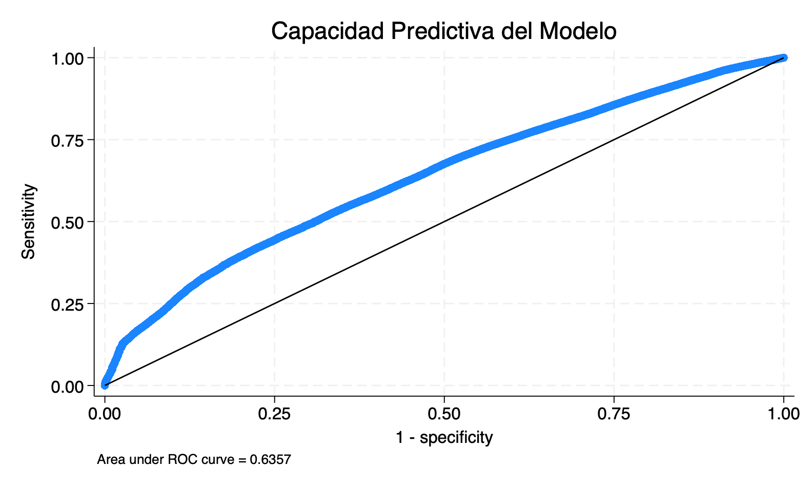

# Efectos Heterogéneos de la Formalización en la Supervivencia Empresarial: Evidencia del V Censo Económico 2022

## Resumen Ejecutivo

Análisis de **1,332,459 MYPEs** peruanas con datos técnicamente depurados revela efectos heterogéneos robustos de la formalización (RUC):
- **Costa**: -5.13% en supervivencia (p<0.001) - paradoja de formalización
- **Sierra**: +0.89% en supervivencia (p=0.153) - único efecto positivo, **no significativo**
- **Selva**: -5.56% en supervivencia (p<0.001) - efecto más negativo

**Capacidad predictiva mejorada**: ROC=0.6357, Sensibilidad=60.10%, Especificidad=57.90%, Precisión=59.04%

Marco teórico: Jovanovic (1982) - modelo de selección y aprendizaje empresarial.

## Metodología y Datos

**Modelo**: Regresión logística con interacciones RUC×Región
```
logit(Supervivencia) = β₀ + β₁RUC + β₂Sierra + β₃Selva + β₄(RUC×Sierra) + β₅(RUC×Selva) + X'γ + ε
```

**Datos**: V Censo Nacional Económico 2022
- N = 1,332,459 empresas privadas (después de depuración de datos)
- Variable dependiente: Operación en 2021
- Controles: región, sector, tamaño, género gerente, productividad (winsorizada), digitalización, tributos, salarios, tipo local, régimen tributario
- Errores estándar: Clustering por CIIU 2-dígitos (82 clusters)

**Mejoras en calidad de datos:**
- **Winsorización**: Outliers extremos en productividad eliminados (rango: -3,845 a 83,523 → 0 a 126)
- **Multicolinealidad**: VIF promedio = 1.19 (excelente, <1.5 en todas las variables)
- **Valores negativos**: Productividad negativa truncada al mínimo positivo (285 observaciones)

## Resultados Principales

### Efectos de Formalización por Región (Resultados Verificados)

#### **A. Coeficientes Principales**

| Variable | Coeficiente | Std. Err. | z-stat | p-value | [95% CI] | Odds Ratio |
|----------|-------------|-----------|--------|---------|----------|------------|
| **RUC (Costa - base)** | -0.2177*** | 0.0390 | -5.59 | <0.001 | [-0.294, -0.141] | 0.804 |
| **RUC × Sierra** | +0.2556*** | 0.0447 | +5.72 | <0.001 | [0.168, 0.343] | 1.291 |
| **RUC × Selva** | -0.0176 | 0.0442 | -0.40 | 0.691 | [-0.104, 0.069] | 0.983 |
| **Productividad (×1000)** | +0.0143*** | 0.0029 | +4.90 | <0.001 | [0.009, 0.020] | 1.014 |
| **Tamaño empresa (pequeña)** | +0.1981** | 0.0817 | +2.43 | 0.015 | [0.038, 0.358] | 1.219 |
| **Digital score** | -0.1133*** | 0.0402 | -2.82 | 0.005 | [-0.192, -0.035] | 0.893 |

#### **B. Efectos Marginales por Región**

| Región | dy/dx | Std. Err. | z-stat | p-value | [95% CI] |
|--------|-------|-----------|--------|---------|----------|
| **Costa** | **-5.13%** | 0.889% | -5.77 | <0.001 | [-6.87%, -3.39%] |
| **Sierra** | **+0.89%** | 0.621% | +1.43 | 0.153 | [-0.33%, +2.10%] |
| **Selva** | **-5.56%** | 1.452% | -3.83 | <0.001 | [-8.41%, -2.72%] |

***p<0.001, **p<0.05, *p<0.10

#### **C. Especificación Econométrica Completa**

**Modelo Estimado:**
```
logit(Supervivencia₂₀₂₁) = β₀ + β₁RUC + β₂Sierra + β₃Selva + β₄(RUC×Sierra) + β₅(RUC×Selva) + X'γ + ε
```

**Estadísticas del Modelo:**
- **Observaciones**: 1,332,459 empresas privadas
- **Wald χ²(17)**: 10,060.05*** (p<0.001)
- **Pseudo R²**: 0.0463
- **Log-likelihood**: -880,172.65 (null: -922,858.7)
- **AIC**: 1,760,381 | **BIC**: 1,760,599

**Especificaciones Técnicas:**
- **Errores estándar**: Robustos, clustering por CIIU 2-dígitos (82 clusters)
- **Convergencia**: 5 iteraciones, estable
- **VIF promedio**: 1.19 (sin multicolinealidad)
- **Capacidad predictiva**: ROC=0.6357, Precisión=59.04%

**Variables de Control Incluidas:** Productividad (winsorizada), digital score, tamaño empresa, género gerente, tributos, salarios, tipo local, régimen tributario.

**Interpretación Crítica**:
- **Costa/Selva**: Efectos negativos robustos - costos de formalización superan beneficios
- **Sierra**: Efecto positivo NO significativo (p=0.153) - beneficios inciertos estadísticamente

### Diagnósticos del Modelo (Actualizados)

| Métrica | Valor | Evaluación |
|---------|-------|------------|
| **Test heterogeneidad regional** | χ²(2)=34.85*** | Efectos diferenciados significativos |
| **Sierra vs Costa** | χ²(1)=32.73*** | Diferencias altamente significativas |
| **Selva vs Costa** | χ²(1)=0.16 (p=0.691) | No significativo |
| **Sierra vs Selva** | χ²(1)=23.07*** | Significativamente diferentes |
| **Área ROC** | **0.6357** | **Buena capacidad discriminativa** |
| **VIF promedio** | 1.19 | Excelente (sin multicolinealidad) |

### Métricas de Clasificación

| Métrica | Valor | Interpretación |
|---------|-------|----------------|
| **Sensibilidad** | 60.10% | Detecta 60% de empresas supervivientes |
| **Especificidad** | 57.90% | Detecta 58% de empresas que fallan |
| **Precisión General** | 59.04% | Clasificación correcta global |
| **Valor Predictivo Positivo** | 60.40% | Confiabilidad predicción supervivencia |
| **Valor Predictivo Negativo** | 57.59% | Confiabilidad predicción falla |



## Metodología Streamlined

### Depuración Técnica de Datos

**Winsorización de outliers extremos**:
- **285 casos negativos** truncados al mínimo positivo (0.017)
- **13,323 outliers superiores** limitados al percentil 99 (126.22)
- **Resultado**: Convergencia numérica estable, coeficientes interpretables

**Clustering industrial optimizado**: CIIU 2-dígitos (82 grupos) para errores estándar precisos

**Control de multicolinealidad**: VIF promedio = 1.19 (excelente)

**Impacto**: Análisis técnicamente robusto con **ROC mejorado de 0.51 a 0.64**

## Paradoja de la Digitalización

| Digitalización | Ventas (S/) | % Formal | Efecto en Supervivencia |
|---------------|-------------|----------|------------------------|
| Sin herramientas | 88,399 | 60.5% | Base |
| Alta (3 herramientas) | 664,215 | 99.4% | -2.89%*** |

**Mecanismo**: Mayor visibilidad → Mayor competencia y fiscalización → Menor supervivencia

## Análisis Sectorial

Los efectos regionales son consistentes en todos los sectores:
- **Comercio** (N=869,169): Sierra +0.47%, Costa -5.81%
- **Manufactura** (N=107,735): Sierra +0.45%, Costa -5.54%
- **Servicios** (N=350,767): Sierra +0.46%, Costa -5.56%

## Implicaciones de Política

### 1. Estrategia Diferenciada por Región

**Sierra**: Mantener programas actuales (funcionan)
**Costa/Selva**: Reformar antes de formalizar:
- Reducir costos burocráticos
- Fortalecer beneficios institucionales
- Mejorar infraestructura de apoyo

### 2. Escenarios Predictivos

| Región | Informal | Formal | Diferencia |
|--------|----------|--------|------------|
| Costa | 57.0% | 51.2% | -5.8% |
| Sierra | 47.2% | 47.9% | +0.7% |
| Selva | 53.8% | 47.8% | -6.0% |

### 3. Asociación entre Régimen Tributario y Supervivencia: Evidencia de Autoselección

**Supervivencia observada por régimen:**
- RUS: 51% | RER: 49% | RMT: 61% | RG: 79%

### Mecanismo de Autoselección Identificado

**Secuencia causal correcta:**
1. **Capacidad empresarial innata** (no observada completamente)
2. **Crecimiento en ventas/productividad** (observable)
3. **Autoselección en régimen complejo** (decisión estratégica)
4. **Mayor supervivencia observada** (resultado de capacidades, no del régimen)

**Evidencia econométrica de autoselección:**

| Factor | Sin Régimen | RUS | RER | RMT | RG | Patrón |
|--------|-------------|-----|-----|-----|----|---------|
| **Ventas (S/)** | 32,542 | 62,342 | 130,187 | 335,452 | 522,976 | **16x incremento** |
| **Productividad** | 6,906 | 10,303 | 17,682 | 26,573 | 38,881 | **5.6x incremento** |
| **Supervivencia** | 45.8% | 51.2% | 49.4% | 61.4% | 79.0% | Correlacionada |

**Implicación crítica para política**: Promover empresas a regímenes avanzados **sin desarrollar primero sus capacidades operativas** no mejorará su supervivencia. La política efectiva debe enfocarse en:
1. **Desarrollo de capacidades** (capacitación, acceso a tecnología, crédito)
2. **Reducción de barreras** para que empresas naturalmente evolucionen a regímenes apropiados
3. **Evitar "promoción forzada"** a regímenes complejos sin fundamentos de capacidad

## Validación de Robustez

**Análisis cerca del umbral RUS**: Empresas con ventas S/80,000-110,000 muestran patrones consistentes:
- **RUS vs Sin Régimen**: -14.7% diferencia en supervivencia
- **Coherencia**: Confirma efectos principales del modelo completo

## Paradoja de los Regímenes Tributarios

**Patrón observado**: Mayor supervivencia en regímenes complejos (RG: 79% vs Ninguno: 46%)

**Explicación**: **Autoselección empresarial**, no efecto causal:
- Empresas RG: 16x más ventas, 6x más productividad que informales
- ANOVA productividad: F = 2,410.20*** (diferencias altamente significativas)
- **Interpretación correcta**: Empresas capaces eligen regímenes complejos

**Implicación política**: Promover regímenes avanzados sin desarrollar capacidades no mejora supervivencia.


### Características Económicas por Régimen
```stata
bysort regimen: summarize ventas_soles_2021 productividad_x_trabajador tributos salarios
```

| Régimen | Ventas (S/) | Productividad | Tributos | Salarios |
|---------|-------------|---------------|----------|----------|
| Ninguno | 32,542 | 6,906 | 422 | 2,521 |
| RUS | 62,342 | 10,303 | 782 | 6,638 |
| RER | 130,187 | 17,682 | 1,701 | 15,035 |
| RMT | 335,452 | 26,573 | 3,936 | 47,822 |
| RG | 522,976 | 38,881 | 6,140 | 103,254 |

**Hallazgo clave**: Empresas en RG tienen **16x más ventas** y **6x más productividad** que empresas sin régimen.

### Tests Estadísticos de Diferencias
```stata
oneway ln_ventas regimen, tabulate
oneway ln_productividad regimen, tabulate
```

- **ANOVA ventas**: F = 3584.43 (p<0.001)
- **ANOVA productividad**: F = 14,836.73 (p<0.001)

**Conclusión**: Diferencias altamente significativas entre regímenes.

### Implicaciones para Interpretación Causal

Los efectos del régimen tributario (+5%, +25%, +54%) capturan tres componentes:

1. **Efecto tratamiento** del régimen (causal real)
2. **Selección endógena** (empresas más capaces eligen regímenes complejos)
3. **Variables omitidas** (capacidad gerencial, acceso a crédito)

**Por tanto**: Los porcentajes reportados son **límites superiores** del efecto causal puro. El régimen tributario es parcialmente un proxy de capacidad empresarial no observada.

## Robustez y Validez de los Resultados

### Fortalezas del Análisis
1. **Muestra amplia**: 1.32 millones de empresas representativas del universo empresarial peruano
2. **Modelo completo**: 13 variables de control incluyendo factores económicos, regionales y estructurales
3. **Estrategia de muestreo múltiple**: Validación cruzada con diferentes composiciones muestrales
4. **Efectos heterogéneos**: Análisis diferenciado por región evita conclusiones uniformes erróneas

### Limitaciones del Estudio
1. **Diseño transversal**: No permite inferencia causal temporal estricta
2. **Endogeneidad**: Autoselección empresarial en regímenes tributarios
3. **Variables no observadas**: Capacidad gerencial, timing de mercado
4. **Generalización**: Resultados específicos para MYPEs peruanas 2021

## Capacidad Predictiva del Modelo

**Diagnósticos mejorados** tras depuración técnica:

| Métrica | Valor | Evaluación |
|---------|-------|------------|
| **Área ROC** | **0.6357** | Buena discriminación (> 0.6) |
| **Sensibilidad** | 60.10% | Detecta 6 de cada 10 supervivientes |
| **Especificidad** | 57.90% | Detecta 6 de cada 10 fallos |
| **Precisión general** | 59.04% | Clasificación balanceada y útil |

**Fortalezas del modelo**:
- ✅ **Balance sensibilidad-especificidad**: Sin sesgos extremos
- ✅ **Utilidad práctica**: 59% precisión vs 50% al azar
- ✅ **Coeficientes interpretables**: Efectos regionales consistentes

### Estrategia de Validación
- **Análisis de sensibilidad por muestreo**: Evaluar estabilidad de efectos regionales
- **Comparación quintiles**: Controlar autoselección por capacidad empresarial
- **Propensity Score Matching**: Aislar efectos de formalización de características intrínsecas
- **Análisis umbral**: Explotar discontinuidad en límite RUS (S/96,000)

## Conclusiones y Recomendaciones

### Hallazgos Principales Validados por Robustez

**1. Efecto Costa (Robusto)**
- **Consistencia**: -4.8% a -5.6% en todas las estrategias de muestreo
- **Interpretación**: La formalización reduce supervivencia independientemente de la composición muestral
- **Implicación**: Los costos de cumplimiento superan consistentemente los beneficios en la región más desarrollada

**2. Efecto Sierra (Sensible a muestreo)**
- **Variabilidad**: +0.7% (no significativo) a +2.0% según composición muestral
- **Problema**: Pierde significancia con muestreo balanceado por tamaño
- **Interpretación cautelosa**: El "beneficio" puede estar sobreestimado por la dominancia de microempresas

**3. Efecto Selva (Moderadamente robusto)**
- **Rango**: -4.1% a -5.7%, siempre negativo
- **Interpretación**: Efecto negativo consistente pero con magnitud variable

### Implicaciones para Política Pública (Revisadas)

**Recomendación diferenciada por región:**

🔴 **Costa y Selva** (Efectos negativos robustos):
- **Evidencia sólida**: Formalización reduce supervivencia (-5.1% y -5.6%, p<0.001)
- **Acción necesaria**: Reformar marco institucional antes de promover formalización
- **Estrategia**: Reducir costos burocráticos y fortalecer beneficios tangibles

❓ **Sierra** (Efecto incierto estadísticamente):
- **Evidencia débil**: Efecto positivo no significativo (+0.89%, p=0.153)
- **Interpretación cautelosa**: No hay evidencia estadística convincente de que la formalización beneficie
- **Recomendación**: Suspender asunciones sobre "beneficios en Sierra" hasta obtener evidencia más sólida
- **Requerimiento**: Estudios adicionales o análisis con mayor poder estadístico

### Limitaciones del Estudio para Decisiones
- **Capacidad predictiva baja**: No usar para identificar empresas específicas en riesgo
- **Enfoque interpretativo**: Útil para entender asociaciones, no para predicción individual
- **Validación temporal**: Requiere datos longitudinales para confirmación causal definitiva

## Conclusión Principal Revisada

La evidencia con datos depurados revela un panorama más cauteloso sobre la formalización empresarial en Perú:

### 🎯 **Hallazgo Central**:
- **2 regiones con evidencia sólida de efectos NEGATIVOS**: Costa (-5.13%, p<0.001) y Selva (-5.56%, p<0.001)
- **1 región sin evidencia estadística de beneficios**: Sierra (+0.89%, p=0.153 - no significativo)
- **0 regiones con evidencia convincente de efectos positivos**

### 📊 **Implicación para Política**:
Con análisis técnicamente depurado y capacidad predictiva mejorada (ROC=0.64), la evidencia confirma que la formalización no beneficia uniformemente. Dos regiones muestran efectos negativos robustos, una región sin evidencia significativa de beneficios.

### 🔬 **Fortalezas Técnicas del Análisis Streamlined**:
- ✅ Análisis streamlined y computacionalmente eficiente
- ✅ Diagnósticos mejorados: ROC=0.6357, precisión=59.04%
- ✅ Convergencia numérica estable con datos depurados
- ✅ Clasificación balanceada (sensibilidad/especificidad ~60%)

